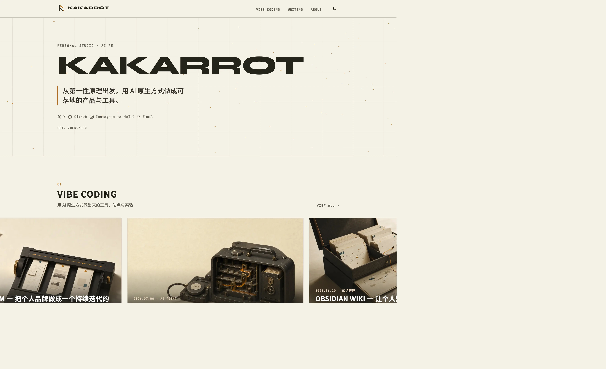

<p align="center">
  <a href="https://kakarrot.com">
    
  </a>
</p>

<h1 align="center">kakarrot.com</h1>

<p align="center">
  <strong>静室 Quiet Studio</strong> · AI 产品经理的个人站与作品集<br/>
  思考、写作与 Vibe Coding 实践 · 设计系统对齐 Claude Cream
</p>

<p align="center">
  <a href="https://kakarrot.com">Website</a>
  ·
  <a href="https://kakarrot.com/rss.xml">RSS</a>
  ·
  <a href="https://github.com/kakarrot-dev">Author</a>
</p>

<p align="center">
  <a href="https://astro.build"></a>
  <a href="https://nodejs.org">= 22.12" /></a>
  <a href="https://pages.github.com"></a>
</p>

<p align="center">
  <a href="https://kakarrot.com">
    
  </a>
</p>

<p align="center"><em>首页：琥珀雾场 Hero · Vibe Coding 封面跑马 · Writing 精选列表</em></p>

---

## Features

- **Content Collections**：Markdown 驱动的 Writing / Vibe Coding
- **Quiet Studio UI**：Cream light/dark、粘性顶栏、品牌 Logo、主题切换防闪
- **首页**：Three.js 琥珀雾场 Hero、Vibe 封面横向跑马、Writing 精选行列表
- **阅读体验**：760px 居中阅读柱、右侧线条 TOC、代码复制、Mermaid、表格 hover
- **信息架构**：`Vibe Coding · Writing · About`；旧 `/projects/*` 重定向至 `/vibe-coding/`
- **纯静态部署**：构建产物写入 `docs/`，由 GitHub Actions 发布

## Stack

| Layer | Choice |
|---|---|
| Framework | [Astro 7](https://astro.build) |
| Styling | Tailwind CSS 4 + `src/styles/global.css` design tokens |
| Content | Astro Content Collections (Markdown) |
| Fonts | Noto Sans SC · Syne · JetBrains Mono（自托管） |
| Motion / 3D | CSS transitions · Three.js（首页 Hero） |
| Diagrams | Mermaid（客户端渲染） |
| Deploy | GitHub Pages + GitHub Actions |

## Requirements

- **Node.js** `>= 22.12.0`（CI 使用 Node 24）
- **npm**（仓库包管理器）

## Getting started

```bash
npm install
npm run dev          # http://localhost:4321
```

| Command | Description |
|---|---|
| `npm run dev` | 本地开发服务器 |
| `npm run check` | Astro / TypeScript 检查 |
| `npm run lint` | 同 `check` |
| `npm run build` | 生产构建 → `docs/` |
| `npm run preview` | 预览构建产物 |

发布前建议：

```bash
npm run check && npm run build
```

## Repository layout

```text
src/
  content.config.ts     Content Collections schema
  components/           UI（Nav、WorkCard、Hero、TOC…）
  content/
    writing/            博客文章
    vibe-coding/        Vibe Coding 作品
    projects/           历史项目 Markdown（站点不再消费，保留数据）
  data/                 共享数据（如社交链接）
  layouts/              BaseLayout · ProseLayout
  pages/                路由
  styles/global.css     设计令牌与全局样式
public/                 静态资源（favicon、logo、CNAME、README 展示图）
docs/                   GitHub Pages 构建产物（勿手改）
.github/workflows/      部署流水线
DESIGN.md               设计系统 SSOT
AGENTS.md               AI Coding Agent 项目规范
CLAUDE.md               Claude Code 入口
```

## Content

| Collection | Path | Route |
|---|---|---|
| Writing | `src/content/writing/` | `/writing/[slug]/` |
| Vibe Coding | `src/content/vibe-coding/` | `/vibe-coding/[slug]/` |

1. 在对应目录新增 Markdown
2. 按 `src/content.config.ts` 填写 frontmatter
3. `draft: true` 可排除未发布内容
4. `npm run build` 验证

Writing 常用字段：`title` · `description` · `publishedAt` · `tags` · `featured` · `draft`  
Vibe Coding 另支持可选 `cover`（见 `DESIGN.md` §8 封面规范）

RSS 聚合 Writing 与 Vibe Coding；不再包含 projects。

## Design system

视觉与交互以 [`DESIGN.md`](./DESIGN.md) 为准：

- 色彩：Claude Cream（light / dark）
- 气质：克制、干净、有呼吸感
- 封面：16:10 母版、站点色约束、静物式构图

UI 改动请优先使用 `global.css` 令牌，勿引入与静室冲突的视觉语言。

品牌标识：

<p align="center">
  
</p>

## Deployment

推送 `master` 触发 [Deploy to GitHub Pages](.github/workflows/deploy.yml)：

1. `npm ci`
2. `npm run check`
3. `npm run build`
4. 上传并部署 `docs/`

自定义域名由 `public/CNAME` 提供。

本地等价流程：

```bash
npm run check && npm run build
git add -A && git commit -m "deploy: …"   # 仅在需要提交产物时
git push origin master
```

> `docs/` 为构建产物目录。改源码后重新 `build`，不要手改 HTML/CSS 产物。

## Agent & contribution notes

本仓库面向个人站点维护，同时约定 AI Coding Agent 行为：

| File | Role |
|---|---|
| [`AGENTS.md`](./AGENTS.md) | 项目级 Agent 规范（Codex 等） |
| [`CLAUDE.md`](./CLAUDE.md) | Claude Code 入口 |
| [`DESIGN.md`](./DESIGN.md) | 设计系统 |

中大型改动建议：先 Spec → Plan → 实现 → `check` / `build`。

## Limitations

- 纯静态站：无后端、数据库、评论、账号系统
- 无单元 / E2E 测试；质量门禁以 `astro check` + 构建 + 人工预览为主
- `src/content/projects/` 仅保留历史数据；对外入口已下线并重定向

## License

源码与站点内容版权归作者所有，未经许可请勿复制整站用于商业用途。  
第三方依赖遵循各自开源许可证。
